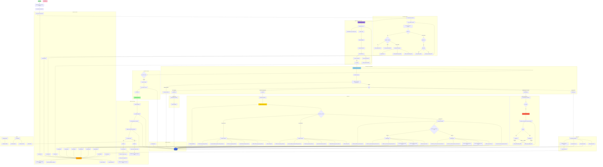

```mermaid
graph TD
    %% ==================== MAIN ENTRY ====================
    Start([main start]) --> Init[Инициализация: env, pool, exchange]
    Init --> ClearBots[clear_orders_ids_for_bots]
    ClearBots --> BatchCancel[batch_cancel_stop_orders]
    BatchCancel --> CleanLoop[loop: auto_clean_account]
    CleanLoop --> WSMainLoop[main WebSocket loop]

    %% ==================== WEBSOCKET CONNECTION ====================
    subgraph "WebSocket Connection Layer"
        WSMainLoop --> GetWSUrl[get_private_ws_url]
        GetWSUrl --> KuCoinClientAPI1[KuCoinClient::api_v1_bullet_private]
        GetWSUrl --> ConnectWS[connect_async]
        ConnectWS --> Subscribe[build_subscription]
        Subscribe --> SendSubscribe[event_ws_write.send]
        SendSubscribe --> WSLoop[tokio::select! loop]
        
        WSLoop --> ReadMsg[event_ws_read.next]
        ReadMsg --> |Text| SendToChannel[tx_in.send]
        WSLoop --> PingTick[event_ping_interval.tick]
        PingTick --> SendPing[event_ws_write.send Ping]
    end

    %% ==================== MESSAGE PROCESSING ====================
    subgraph "Message Processing Pipeline"
        SendToChannel --> SpawnProcess[spawn_process_kcn_msg]
        SpawnProcess --> ProcessMsg[process_kcn_msg]
        ProcessMsg --> DeserializeMsg[serde_json::from_str KuCoinMessage]
        
        DeserializeMsg --> |Welcome/Ack/Error| LogEvent[insert_db_event/error]
        DeserializeMsg --> |Message| RouteTopic{topic}
        
        RouteTopic --> |/account/balance| BalanceFlow
        RouteTopic --> |/spotMarket/tradeOrdersV2| OrderFlow
        RouteTopic --> |/spotMarket/advancedOrders| AdvancedFlow
        RouteTopic --> |/margin/position| PositionFlow
    end

    %% ==================== BALANCE FLOW ====================
    subgraph "Balance Flow"
        BalanceFlow --> ParseBalance[BalanceData::deserialize]
        ParseBalance --> InsertBalance[insert_db_balance]
    end

    %% ==================== ORDER FLOW ====================
    subgraph "Order Flow"
        OrderFlow --> ParseOrder[OrderData::deserialize]
        ParseOrder --> HandleOrder[handle_trade_order_event]
        HandleOrder --> InsertOrderEvent[insert_db_orderevent]
        
        HandleOrder --> CheckBotType{check client_oid in bots}
        
        CheckBotType --> |exit_tp_client_oid| TPComplete[TP Order Complete]
        TPComplete --> DeleteTP[delete_exit_tp_id_bot_by_client_oid]
        TPComplete --> CancelSLOrder[api_v3_hf_margin_stop_order_cancel_by_client_oid]
        TPComplete --> DeleteSL[delete_exit_sl_id_bot_by_client_oid]
        TPComplete --> GetMatchValueTP[get_total_match_value_by_client_oid]
        TPComplete --> UpdateBalanceTP[update_balance_bot_by_exit_tp_client_oid]
        TPComplete --> NewRandomTrade1[make_random_trade]
        
        CheckBotType --> |exit_sl_client_oid| SLComplete[SL Order Complete]
        SLComplete --> DeleteSL2[delete_exit_sl_id_bot_by_client_oid]
        SLComplete --> CancelTPOrder[api_v3_hf_margin_stop_order_cancel_by_client_oid]
        SLComplete --> DeleteTP2[delete_exit_tp_id_bot_by_client_oid]
        SLComplete --> GetMatchValueSL[get_total_match_value_by_client_oid]
        SLComplete --> UpdateBalanceSL[update_balance_bot_by_exit_sl_client_oid]
        SLComplete --> NewRandomTrade2[make_random_trade]
        
        CheckBotType --> |entry_client_oid| EntryComplete[Entry Order Complete]
        EntryComplete --> UpdateBalanceEntry[update_bot_balance_by_entry_client_oid]
        EntryComplete --> CalcTPSL{calculate TP/SL based on side}
        
        CalcTPSL --> |side=buy| BuyStopOrders
        CalcTPSL --> |side=sell| SellStopOrders
        
        BuyStopOrders --> UpdateTPClientBuy[update_exit_tp_client_oid_bot_by_entry_client_oid]
        BuyStopOrders --> UpdateSLClientBuy[update_exit_sl_client_oid_bot_by_entry_client_oid]
        BuyStopOrders --> CreateTPBuy[api_v3_hf_margin_stop_order TP +7%]
        BuyStopOrders --> CreateSLBuy[api_v3_hf_margin_stop_order SL -5%]
        BuyStopOrders --> LinkOrderIdsBuy[update_exit_tp/sl_order_id]
        
        SellStopOrders --> UpdateTPClientSell[update_exit_tp_client_oid_bot_by_entry_client_oid]
        SellStopOrders --> UpdateSLClientSell[update_exit_sl_client_oid_bot_by_entry_client_oid]
        SellStopOrders --> CreateTPSell[api_v3_hf_margin_stop_order TP -7%]
        SellStopOrders --> CreateSLSell[api_v3_hf_margin_stop_order SL +5%]
        SellStopOrders --> LinkOrderIdsSell[update_exit_tp/sl_order_id]
        
        EntryComplete --> ClearEntry[set_null_entry_client_oid_by_entry_client_oid]
    end

    %% ==================== ADVANCED ORDERS FLOW (Error Recovery) ====================
    subgraph "Advanced Orders Flow"
        AdvancedFlow --> ParseAdvanced[AdvancedOrders::deserialize]
        ParseAdvanced --> CheckError{error exists?}
        CheckError --> |Yes| RetryLoop[Retry Loop MAX 1000]
        RetryLoop --> UpdateBotRef[update_exit_sl/tp_client_oid_bot_by_order_id]
        UpdateBotRef --> DetermineType{stop type}
        DetermineType --> |loss| HandleLoss
        DetermineType --> |entry| HandleEntry
        
        HandleLoss --> |side=buy| RecreateFundsOrder[make_hf_funds_margin_order]
        HandleLoss --> |side=sell| RecreateSizeOrder[make_hf_size_margin_order]
        HandleEntry --> |side=buy| RecreateFundsOrder
        HandleEntry --> |side=sell| RecreateSizeOrder
    end

    %% ==================== POSITION FLOW ====================
    subgraph "Position Flow"
        PositionFlow --> ParsePosition[PositionData::deserialize]
        ParsePosition --> RepayLoans[Repay borrows from asset_list]
        RepayLoans --> CreateRepay[create_repay_order]
        ParsePosition --> UpsertRatio[upsert_position_ratio]
        ParsePosition --> UpsertDebt[upsert_position_debt]
        ParsePosition --> UpsertAsset[upsert_position_asset]
    end

    %% ==================== AUTO CLEAN ACCOUNT ====================
    subgraph "Auto Clean Account"
        CleanLoop --> GetMarginAcc[get_all_margin_accounts]
        GetMarginAcc --> ForEachCurrency[for each currency in accounts]
        
        ForEachCurrency --> CheckLiability{liability > 0?}
        CheckLiability --> |yes| CheckAvailable{available >= liability?}
        CheckAvailable --> |yes| FullRepay[create_repay_order full]
        CheckAvailable --> |partial| PartialRepay[create_repay_order partial]
        CheckAvailable --> |no & not USDT| BuyToRepay[Buy tokens with margin]
        
        BuyToRepay --> GetPriceBuy[get_ticker_price]
        BuyToRepay --> GetSymbolBuy[fetch_symbol_info_by_symbol]
        BuyToRepay --> MakeMarginBuy[make_hf_funds_margin_order]
        
        CheckLiability --> |no & not USDT| CheckExcess{available > 0?}
        CheckExcess --> |yes| CheckMinAmount{below min?}
        CheckMinAmount --> |yes| TransferToTrade[sent_account_transfer]
        CheckMinAmount --> |no| SellExcessTokens[make_hf_size_margin_order]
    end

    %% ==================== INITIAL ORDERS ====================
    subgraph "Initial Orders Creation"
        SpawnProcess --> InitOrdersCheck{init_order_execute?}
        InitOrdersCheck --> |first time| CreateInitOrders[create_init_orders]
        CreateInitOrders --> GetAllBots[get_all_bots_for_trade]
        GetAllBots --> ForEachBot[for each bot]
        ForEachBot --> MakeRandomTrade
    end

    %% ==================== RANDOM TRADE LOGIC ====================
    subgraph "Random Trade Logic"
        MakeRandomTrade --> RetryRandom[Retry Loop MAX 10]
        RetryRandom --> GetRandomSymbol[get_random_symbol]
        GetRandomSymbol --> GetSymbolInfo[fetch_symbol_info_by_symbol]
        GetSymbolInfo --> UpdateBotEntry[update_bot_entry_client_oid_by_id]
        UpdateBotEntry --> GetRandomSide[get_random_side]
        
        GetRandomSide --> |sell| SellFlow
        GetRandomSide --> |buy| BuyFlow
        
        SellFlow --> GetPriceSell[get_ticker_price]
        GetPriceSell --> CalcSize[token_size = balance / price]
        CalcSize --> MakeSizeOrder[make_hf_size_margin_order]
        
        BuyFlow --> MakeFundsOrder[make_hf_funds_margin_order]
        
        MakeSizeOrder --> OnError1[update_bot_entry_client_oid_by_id NULL]
        MakeFundsOrder --> OnError2[update_bot_entry_client_oid_by_id NULL]
    end

    %% ==================== HTTP REQUESTS LAYER ====================
    subgraph "KuCoin HTTP Client"
        GetWSUrl --> KuCoinClient1[KuCoinClient]
        BatchCancel --> KuCoinClient2
        GetMarginAcc --> KuCoinClient3
        CreateRepay --> KuCoinClient4
        CancelSLOrder --> KuCoinClient5
        CancelTPOrder --> KuCoinClient6
        CreateTPBuy --> KuCoinClient7
        CreateSLBuy --> KuCoinClient8
        CreateTPSell --> KuCoinClient9
        CreateSLSell --> KuCoinClient10
        GetPriceBuy --> KuCoinClient11
        GetPriceSell --> KuCoinClient12
        
        KuCoinClient1 --> MakeRequest[make_request]
        KuCoinClient2 --> MakeRequest
        KuCoinClient3 --> MakeRequest
        KuCoinClient4 --> MakeRequest
        KuCoinClient5 --> MakeRequest
        KuCoinClient6 --> MakeRequest
        KuCoinClient7 --> MakeRequest
        KuCoinClient8 --> MakeRequest
        KuCoinClient9 --> MakeRequest
        KuCoinClient10 --> MakeRequest
        KuCoinClient11 --> MakeRequest
        KuCoinClient12 --> MakeRequest
        
        MakeRequest --> GenSignature[generate_signature HMAC-SHA256]
        MakeRequest --> GenPassphrase[generate_passphrase_signature]
        MakeRequest --> AddHeaders[KC-API-* headers]
        MakeRequest --> SendHTTP[reqwest::Client.send]
    end

    %% ==================== DATABASE LAYER ====================
    subgraph "Database Operations"
        InsertBalance --> DB[(PostgreSQL)]
        InsertOrderEvent --> DB
        LogEvent --> DB
        InsertError[insert_db_error] --> DB
        GetMatchValueTP --> DB
        UpdateBalanceTP --> DB
        UpdateBalanceSL --> DB
        UpdateBalanceEntry --> DB
        GetRandomSymbol --> DB
        GetSymbolInfo --> DB
        UpdateBotEntry --> DB
        UpdateTPClientBuy --> DB
        UpdateSLClientBuy --> DB
        UpdateTPClientSell --> DB
        UpdateSLClientSell --> DB
        LinkOrderIdsBuy --> DB
        LinkOrderIdsSell --> DB
        DeleteTP --> DB
        DeleteSL --> DB
        ClearEntry --> DB
        UpsertRatio --> DB
        UpsertDebt --> DB
        UpsertAsset --> DB
        GetAllBots --> DB
        UpdateBotRef --> DB
    end

    %% ==================== UTILITIES ====================
    subgraph "Utilities"
        GetRandomSide --> FastRand[fastrand::bool]
        BuildSubscription --> SubJSON[subscription JSONs]
        FormatAssert --> CalcPrecision[calculate precision]
        FormatAssert --> RoundSize[round by increment]
    end

    %% ==================== STYLES ====================
    style Start fill:#90EE90
    style SpawnProcess fill:#87CEEB
    style HandleOrder fill:#FFD700
    style AutoClean fill:#FFB6C6
    style MakeRandomTrade fill:#98FB98
    style MakeRequest fill:#FFA500
    style DB fill:#4169E1,color:#white
    style WSMainLoop fill:#9370DB
    style RetryLoop fill:#FF6347
```